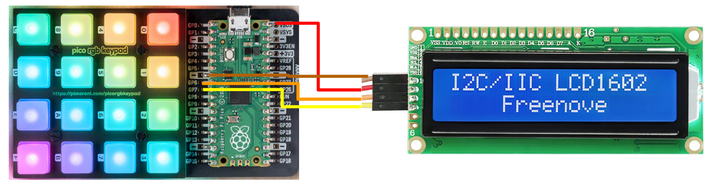
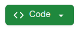
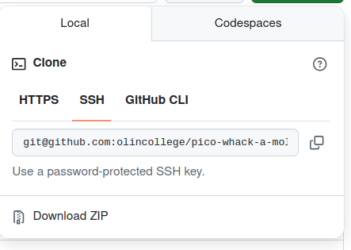

# Whack-a-Mole with RaspberryPi Pico and RGB LED Matrix

Ellen Sun, Swasti Jain, Meagan Lipsman

Have you ever wanted to play a fun handheld version of one of your favorite childhood games? Well you're in luck, because this project implements a Whack-A-Mole style game on a RasberryPi Pico RGB keypad display.

## How It Works

The game functions by randomly lighting up buttons one at a time for varying lengths of time. The user must press the button while it is lit to earn a point. If the user hits a button that is not lit then they loose and the game will end.

### Features

- Fluid response
- Track your score
- Reset button at end of game for multiple rounds

<div align="center">
    
</div>

## Material

The following materials are needed to run the game:

- [Rasperry Pi Pico](https://shop.pimoroni.com/products/raspberry-pi-pico-2-w?variant=54852252991867)
- [Pimoroni Pico RGB Keypad Base](https://shop.pimoroni.com/products/pico-rgb-keypad-base?variant=32369517166675)
- USB to Micro USB-B cord
- Computer configured to run this program
- Two 20x1 pin style (Male) Header Pins
- [LED Display Screen](https://www.amazon.com/dp/B0B76YGDV4?ref=cm_sw_r_cso_sms_apin_dp_PSMCENFZE8E7QDNYRK0P&ref_=cm_sw_r_cso_sms_apin_dp_PSMCENFZE8E7QDNYRK0P&social_share=cm_sw_r_cso_sms_apin_dp_PSMCENFZE8E7QDNYRK0P&titleSource=avft-a&previewDoh=1&th=1)
- Four socket to socket (female to female) jumper cables

## Hardware Set Up

1. Acquire all of your hardware pieces.
2. Solder the header pins to the RasPi Pico with the shorter ends on the side with the bootsell button.
3. Insert the Pico pins into the header pin holder already present on the RGB keypad board. Install the board with the bootsell button facing upwards so the button is easily accessible.
4. Use the socket to socket jumpers to attach the RBG keypad to the LED display. Connect the 1 pin on the LED display to the VBUS pin on the pico, connect the 2 pin on the LED display to a ground pin on the pico, connect the 3 pin on the LED display to the GP6 pin on the pico, and finally connect the 4 pin on the LED display to the GP 7 pin on the pico.
   

## Software Set up

1. Make sure that you have CMake set up so that you can build and run code.
2. Create a folder for the project.
3. In this folder clone _this_ repository using

```
$ git clone
```

and copy and pasting the link given when clicking the green code button and selecting the SSH option  

4. In the same folder, clone the pico-sdk repository using the below command. This will give us access to all the Pico functions needed to run our repo.

```
$ git clone -b master https://github.com/raspberrypi/pico-sdk.git
```

5. Create a .txt file called `pico_sdk_path.txt`, and type out the path to your `pico-sdk` folder on only the first line. This will set environment path variable `PICO_SDK_PATH`.

6. Go into the `pico-sdk` folder using:

```
$ cd pico-sdk
```

7. Run the command:

```
$ git submodule update --init
```

8. Also needed is the [Pimoroni RGB Keybad Library](https://github.com/pimoroni/pimoroni-pico/tree/main/libraries/pico_rgb_keypad) which has already been included as a part of this repository.

## Building/Uploading Code

To build code go into your build folder using:

```
$ cd build/
```

Next run CMake to compile and build the executable using the following commands:

```
$ cmake ..
$ make
```

To flash code onto the Pico, start by pressing the `BOOTSEL` button and holding it down while you plug the USB into your computer. In your File Explorer, you should see a new storage location named `RPI-RP2` pop up.

Next, find the main loop executable: `pico-whack-a-mole\build\src\main_loop.uf2`. This file is created when you build your code. Drag and drop this file into `RPI-RP2`.

You will need to do this everytime when rebuilding or flashing new code.
